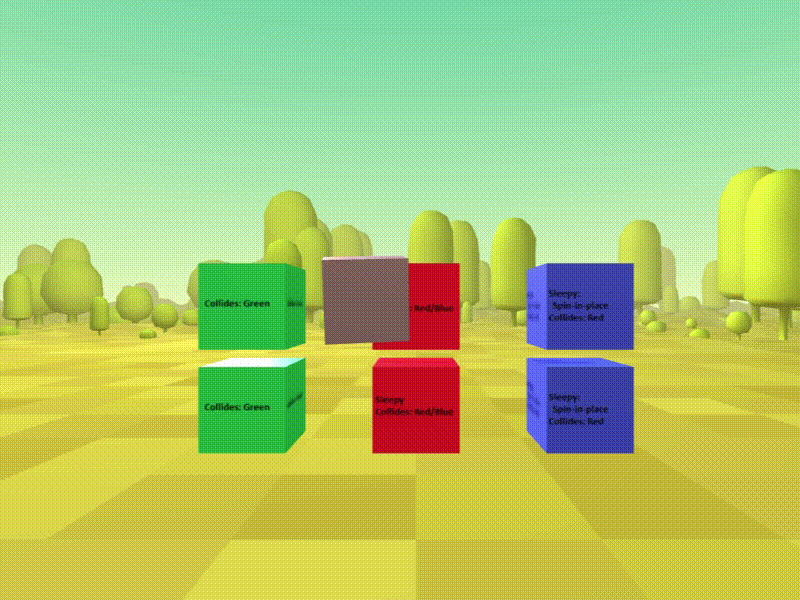

# A-Frame Physics Extras
[](https://www.npmjs.com/package/aframe-physics-extras)
[](https://www.npmjs.com/package/aframe-physics-extras)
[](https://travis-ci.org/wmurphyrd/aframe-physics-extras)

Add-on components for the
[`aframe-physics-system`](https://github.com/donmccurdy/aframe-physics-system)
to add additional collision detection and behavior control options.



* [physics-collider](#physics-collider)
* [collision-filter](#collision-filter)
* [sleepy](#sleepy)

## physics-collider

A collision detection component powered by the physics simulation with low
overhead and precise collision zones. This is intended to be placed on
tracked controller entities to monitor collisions and report them to
a gesture interpretation component such as
[super-hands](https://github.com/wmurphyrd/aframe-super-hands-component).

### API

| Property | Description | Default Value |
| -------- | ----------- | ------------- |
| ignoreSleep | Wake sleeping bodies on collision?   | `true` |

`physics-collider` can also report collisions with static bodies when
`ignoreSleep` is `true`. This can be useful to create collision detection zones
for interactivity with things other than dynamic bodies.

### Events

| Type | Description | Detail object |
| --- | --- | --- |
| collisions | Emitted each tick if there are changes to the collision list | `els`: array of new collisions. `cleardEls`: array of collisions which have ended. |

## collision-filter

Control which physics bodies interact with each other or ignore each other.
This can improve physics system performance by skipping unnecessary
collision checks. It also controls which entities can be interacted with
via `physics-collider`

### API

| Property | Description | Default Value |
| -------- | ----------- | ------------- |
| group | Collision group this entity belongs to  | `'default'` |
| collidesWith | Array of collision groups this entity will interact with | `'default'` |
| collisionForces | Should other bodies react to collisions with this body? | `true` |

`collisionForces` controls whether collisions with this body generate any
forces. Setting this to `false` allows for collisions to be registered and
tracked without causing any corresponding movement. This is useful for
your controller entities with `physics-collider` because it is difficult
to pick things up if they are constantly bumped away when your hand gets close.
This can be toggles through events with a controller button press
if you want to be able to bump other
objects sometimes and reach inside to pick them up other times.
[There is an example of this on the examples page](#examples).

Turning off `collisionForces` can also be useful
for setting static bodies as collision zones to detect the presence
of other entities without disturbing them.

## sleepy

Make entities settle down and be still after physics collisions. Very useful
for zero-gravity user interfaces to keep entities from floating away. Also
can help performance as sleeping bodies are handled efficiently by the physics
simulation.

### API

| Property | Description | Default Value |
| -------- | ----------- | ------------- |
| allowSleep | Enable sleep for this body | `true` |
| speedLimit | Maximum velocity for sleep to initiate | `0.25` |
| delay | Time interval to check for sleep initiation (seconds) | `0.25` |
| linearDamping | Deceleration of liner forces on the entity (0 to 1) | `0.99` |
| angularDamping | Deceleration of angular forces on the entity (0 to 1) | `0.99` |
| holdState | Entity state in which sleep is suspended | `'grabbed'` |

Adding `sleepy` to any body will activate sleep for the entire physics system
and will affect other bodies because the cannon defaults for all bodies
are to allow sleep with a speed limit of 0.1 and delay of 1 second. You can
add `sleepy="allowSleep: false; linearDamping: 0.01; angularDamping: 0.01"`
to restore default behavior to an entity if needed.
Sleeping bodies will ignore static bodies
(hence why `physics-collider` has an `ignoreSleep` setting) until they
are woken by a dynamic or kinematic body. Sleep will break constraints,
so the `holdState` property allows you to suspend sleep during interactions
such as grabbing/carrying the entity.

## Examples

[View the examples page](http://wmurphyrd.github.io/aframe-physics-extras/examples/) to see `aframe-physics-extras` in action.

## Installation

### Browser

Install and use by directly including the [browser files](dist):

[](https://glitch.com/edit/#!/remix/blue-animal)

```html
<!DOCTYPE html>
<html>
 <head>
  <title>My A-Frame Scene</title>
  <script src="https://aframe.io/releases/0.7.0/aframe.min.js"></script>
  <script src="//cdn.rawgit.com/donmccurdy/aframe-physics-system/v2.1.0/dist/aframe-physics-system.min.js"></script>
  <script src="https://unpkg.com/super-hands@2.0.2/dist/super-hands.min.js"></script>
  <script src="https://unpkg.com/aframe-physics-extras@0.1.2/dist/aframe-physics-extras.min.js"></script>
</head>

<body>
  <a-scene physics="gravity: 0">
    <a-assets>
      <a-mixin id="controller"
               physics-collider
               static-body="shape: sphere; sphereRadius: 0.02"
               super-hands="colliderEvent: collisions;
                            colliderEventProperty: els;
                            colliderEndEvent: collisions;
                            colliderEndEventProperty: clearedEls"
               collision-filter = "group: hands;
                                   collidesWith: red, blue;
                                   collisionForces: false">
      </a-mixin>
      <a-mixin id="cube" dynamic-body grabbable
          geometry="primitive: box; width: 0.5; height: 0.5; depth: 0.5">
      </a-mixin>
    </a-assets>
    <!-- settings pulled in from controller mixin above -->
    <a-entity hand-controls="left" mixin="controller"></a-entity>
    <a-entity hand-controls="right" mixin="controller"></a-entity>
    <!-- can be picked up because it collides with the hands group and vice versa -->
    <a-entity mixin="cube" position="0 1.6 -1" material="color: red" sleepy
        collision-filter="group: red; collidesWith: default, hands, blue">
    </a-entity>
    <!-- even though the controller has blue in its collidesWith list,
         since the blue cube doesn't also have hands in its list, you cannot
         pick it up, but you can knock it around with the red cube -->
    <a-entity mixin="cube" position="0 1 -1" material="color: blue" sleepy
        collision-filter="group: blue; collidesWith: default, red">
    </a-entity>
    <!-- floor entity. 'default' collision group so cubes will bounce off -->
    <a-box width="20" depth="20" height="0.1" static-body
           collision-filter="collidesWith: red, blue"
        material="color: #7BC8A4"></a-box>
  </a-scene>
</body>
</html>
```

### npm

Install via npm:

```bash
npm install
```

Then require and use.

```js
require('aframe');
require('aframe-physics-system')
require('aframe-physics-extras');
```
